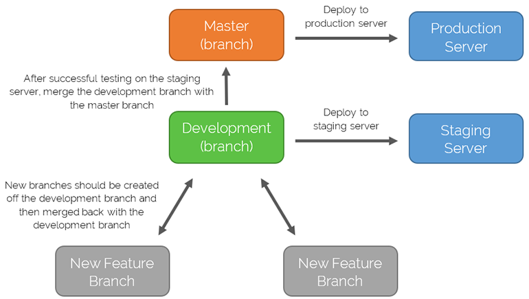

# Git

## Ideal workflow

> There is one rule for the master branch; it should always be deployable.

!> There should be a development branch off the master branch.

Any development work should be carried out on a new branch off the production branch. This branch should have a descriptive name such as the feature you are working on e.g. `newsletter-form`. If you are carrying out a lot of changes then you should add your name to it e.g. `develop/simon`.

You are then free to carry out any changes, commit and push to this branch. When you are happy and want to add this to the main project, make a pull request and then merge with the development branch.

The development branch should then be deployed to the staging server. After successful testing on the staging server, make a pull request on the development branch and merge with the master branch.

You can then deploy from the master branch to the production server.

---

## Cloning a repository

*	Navigate to the repository on GitHub
*	Click the “Clone or download” button
*	Copy the URL
*	Navigate and open a terminal window in the directory you want the files to be cloned to
*	Run `git clone <the copied url>`. This will create a new folder with the same name as the repo and download the files in to it
*	If you would like to download the files in to your current folder, instead `run git clone <the copied url> .`

## Branches

### Creating a new branch

*	If you would like to create a branch off the master branch, `run git checkout -b <name-of-new-branch>`. This will create a branch off the master branch
*	If you would like to create a branch from another branch run `git checkout -b <name-of-new-branch> <name-of-origin-branch>`

### Switching branches

Run `git checkout <name-of-branch>`

## Making changes

*	Run `git add -A`
*	Run `git commit -m “Your commit message”`
*	Run `git push origin <name-of-branch>`
